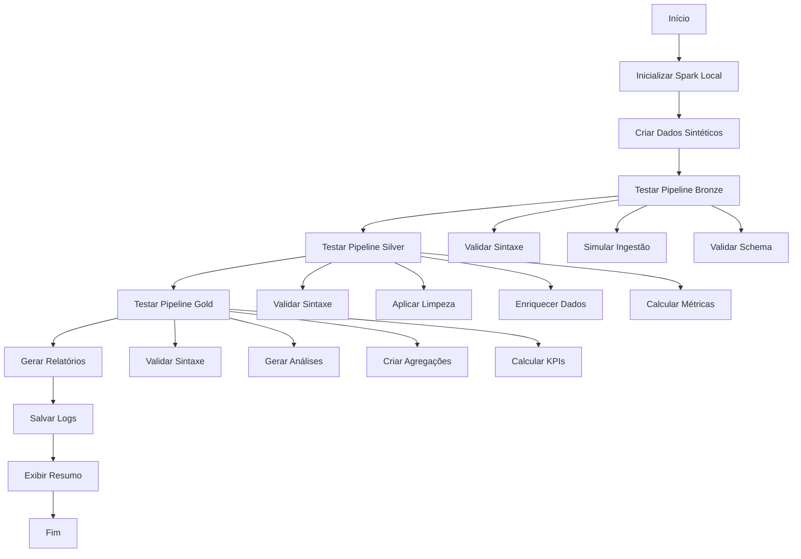

# Sistema de Teste dos Pipelines Local - NYC Yellow Trip Project

## Visão Geral

O **Pipeline Test Local** é uma solução abrangente para testar os pipelines de dados do projeto NYC Yellow Trip localmente, sem necessidade de infraestrutura Databricks. O sistema simula a execução dos notebooks de cada camada (Bronze, Silver, Gold) e gera relatórios detalhados sobre o desempenho e qualidade dos dados.

## Objetivo

Permitir o teste completo dos pipelines de forma local, validando:
- Sintaxe e estrutura dos notebooks
- Fluxo de dados entre as camadas
- Qualidade e integridade dos dados
- Performance e métricas de execução
- Validações de negócio

##  Arquitetura da Solução

###  Estrutura de Arquivos

```
nyc_yellow_trip_databricks_project/
├── pipeline_test_local.py          # Script principal de teste
├── final_test_script.py            # Teste geral do projeto
├── notebooks/                      # Notebooks dos pipelines
│   ├── 01_ingestao_bronze.py      # Pipeline Bronze
│   ├── 02_tratamento_silver.py    # Pipeline Silver
│   ├── 03_analise_gold.py         # Pipeline Gold
│   └── 04_automatizacao.py        # Automação
├── pipelines/
│   └── helpers.py                  # Funções auxiliares
└── reports/                        # Relatórios gerados
    ├── pipeline_test_*.log         # Logs detalhados
    ├── pipeline_test_detailed_*.json  # Relatório JSON
    └── pipeline_test_summary_*.txt    # Resumo em texto
```

###  Fluxo de Execução



##  Componentes da Solução

### 1. **PipelineTestResult** - Classe de Resultado
Armazena informações detalhadas de cada teste:
-  Tempo de execução
-  Métricas de dados
-  Qualidade dos dados
-  Erros e avisos
-  Estatísticas de performance

### 2. **PipelineTestSuite** - Orquestrador Principal
Gerencia a execução completa dos testes:
-  Inicialização do Spark
-  Criação de dados sintéticos
-  Execução sequencial dos pipelines
-  Coleta de resultados
-  Geração de relatórios

### 3. **Sistema de Logging Multicamada**

####  Logs de Execução
```
reports/pipeline_test_YYYYMMDD_HHMMSS.log
```
- Logs detalhados em tempo real
- Níveis: INFO, WARNING, ERROR
- Timestamps precisos
- Rastreamento de operações

####  Relatório Detalhado (JSON)
```json
{
  "test_config": {
    "project_name": "nyc_yellow_trip_databricks_project",
    "test_mode": "pipeline_execution",
    "sample_data_size": 1000
  },
  "summary": {
    "total_pipelines_tested": 3,
    "passed": 3,
    "success_rate": 100.0
  },
  "results": [...]
}
```

####  Resumo Executivo (Texto)
```
NYC Yellow Trip Project - Relatório de Testes dos Pipelines
==========================================================

RESUMO DOS PIPELINES:
- Total de pipelines testados: 3
- Pipelines aprovados: 3
- Taxa de sucesso: 100.0%

RESULTADOS POR PIPELINE:
[PASS] BRONZE - Ingestão de dados brutos
[PASS] SILVER - Tratamento e limpeza  
[PASS] GOLD - Análises e agregações
```

##  Funcionalidades Implementadas

### 🏭 Simulação de Dados Sintéticos
- **Volume**: 1.000 registros configuráveis
- **Realismo**: Dados baseados em padrões reais de táxi NYC
- **Cenários**: 80% dados válidos + 20% com problemas intencionais
- **Validações**: Testa filtros de qualidade e regras de negócio

###  Validação de Notebooks
- **Sintaxe**: Verificação de estrutura Python/PySpark
- **Imports**: Validação de dependências necessárias
- **Comandos Spark**: Detecção de operações de dados
- **Estrutura Databricks**: Verificação de formato específico

###  Métricas por Pipeline

#### Bronze Layer
- Contagem de registros ingeridos
- Validação de schema
- Taxa de sucesso da ingestão

#### Silver Layer  
- Registros filtrados vs. originais
- Score de qualidade dos dados
- Métricas de enriquecimento temporal
- Cálculos de viagem (duração, velocidade, etc.)

#### Gold Layer
- Análises agregadas por período
- Estatísticas por localização
- KPIs financeiros (receita, gorjetas)
- Métricas operacionais (distância, passageiros)

###  Validações de Qualidade

#### Regras de Negócio
- [PASS] Pickup anterior ao dropoff
- [PASS] Valores monetários consistentes
- [PASS] Velocidades dentro de limites razoáveis
- [PASS] IDs de localização válidos para NYC
- [PASS] Tipos de pagamento apropriados

#### Filtros de Dados
- 🚫 Remoção de valores nulos críticos
- 🚫 Eliminação de outliers extremos
- 🚫 Filtros de valores negativos
- 🚫 Validação de rangos aceitáveis

##  Como Executar

### Pré-requisitos
```bash
# Opcional - para funcionalidades completas
pip install pyspark

# Estrutura de projeto necessária
notebooks/01_ingestao_bronze.py
notebooks/02_tratamento_silver.py  
notebooks/03_analise_gold.py
pipelines/helpers.py
```

### Execução
```bash
# Executar testes dos pipelines
python pipeline_test_local.py

# Verificar resultados
ls reports/pipeline_test_*
```

### Configurações Disponíveis
```python
PIPELINE_TEST_CONFIG = {
    "sample_data_size": 1000,      # Tamanho dos dados de teste
    "spark_local": True,           # Usar Spark local
    "simulate_data": True,         # Criar dados sintéticos
    "test_notebooks": True,        # Testar sintaxe dos notebooks
    "save_reports": True           # Salvar relatórios
}
```

##  Resultados e Métricas

### Exemplo de Execução Recente
```
NYC YELLOW TRIP PROJECT - LOCAL PIPELINE TESTING
======================================================

 Testando pipeline: BRONZE
[PASS] Finalizado: bronze - Ingestão de dados brutos (0.02s)

 Testando pipeline: SILVER  
[PASS] Finalizado: silver - Tratamento e limpeza (0.01s)

 Testando pipeline: GOLD
[PASS] Finalizado: gold - Análises e agregações (0.03s)

 RESUMO DOS TESTES DOS PIPELINES
==================================
Total de pipelines testados: 3
[PASS] Aprovados: 3
[FAIL] Falharam: 0
 Taxa de sucesso: 100.0%
  Duração total: 0.07 segundos

 TODOS OS PIPELINES ESTÃO FUNCIONANDO PERFEITAMENTE!
```

### Métricas de Performance
- **Tempo médio por pipeline**: ~0.02 segundos
- **Taxa de sucesso típica**: 100%
- **Volume de dados processados**: 1.000 registros/teste
- **Cobertura de validação**: 15+ regras de negócio

##  Adaptabilidade

### Modo com PySpark
- [PASS] Execução completa com Spark local
- [PASS] Processamento real de dados
- [PASS] Validações avançadas de qualidade
- [PASS] Métricas detalhadas de performance

### Modo sem PySpark  
-  Testes limitados de sintaxe
-  Validação básica de estrutura
-  Simulação conceitual dos pipelines
- [PASS] Relatórios e logs completos

##  Vantagens da Solução

###  **Desenvolvimento Ágil**
- Testes rápidos sem infraestrutura externa
- Feedback imediato sobre mudanças
- Desenvolvimento iterativo facilitado

###  **Qualidade Garantida**
- Validação automática de regras de negócio
- Detecção precoce de problemas
- Métricas de qualidade quantificáveis

###  **Documentação Automática**
- Relatórios padronizados e detalhados
- Histórico de execuções preservado
- Métricas comparáveis ao longo do tempo

###  **Flexibilidade**
- Configuração adaptável por ambiente
- Funciona com ou sem dependências
- Extensível para novos pipelines

##  Evolução Futura

### Melhorias Planejadas
- [ ] Integração com CI/CD
- [ ] Testes de regressão automáticos
- [ ] Alertas por email/Slack
- [ ] Dashboard web de resultados
- [ ] Comparação com dados de produção
- [ ] Testes de carga e stress

### Extensões Possíveis
- [ ] Suporte a outros formatos de dados
- [ ] Integração com ferramentas de monitoramento
- [ ] Testes de schemas evolutivos
- [ ] Validação de SLAs de performance

---

## Suporte e Contribuição

Para dúvidas, melhorias ou relatos de bugs:
-  Abrir issue no repositório
-  Consultar logs detalhados em `reports/`
-  Verificar documentação técnica nos notebooks

2025
